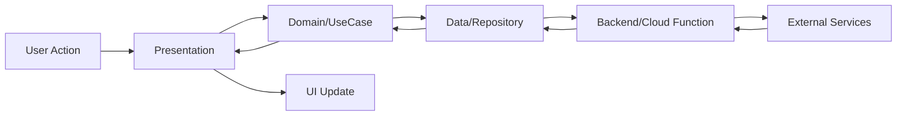

# pixcraft

A new Flutter project.

## How To Setup

# setup firebase

1. create firebase firestore named 'pixcraft', and set rules

<pre>
    rules_version = '2';

    service cloud.firestore {
    match /databases/pixcraft/documents {
    match /user_generations/{generationId} {

        allow read: if request.auth != null
                && request.auth.uid == resource.data.userId;

        allow create: if request.auth != null
                        && request.auth.uid == request.resource.data.userId;

        allow update: if request.auth != null
                        && request.auth.uid == resource.data.userId
                        && request.resource.data.userId == resource.data.userId;

        allow delete: if request.auth != null
                        && request.auth.uid == resource.data.userId;
        }

        match /_health_check/{document=**} {
        allow read, write: if true;
        }

        match /{document=**} {
        allow read, write: if false;
        }

    }
    }
</pre>

2. create cloud function,

3. create firebase storage and setup rules

<pre>
rules_version = '2';
service firebase.storage {
  match /b/{bucket}/o {
    // Original images
    match /originals/{userId}/{allPaths=**} {
      allow read: if request.auth != null;
      allow write: if request.auth != null && request.auth.uid == userId;
    }
    
    // Generated images
    match /generated/{userId}/{allPaths=**} {
      allow read: if request.auth != null;
      allow write: if request.auth != null && request.auth.uid == userId;
    }
  }
}
</pre>

4. create firebase auth and enable Anonymous sign method

# setup google cloud api

1. create a google service (in my case i name it 'firebase-ai-generator') account and assign role

   - Firebase as admin
   - Storage as admin
   - Vertex Ai as user

2. create keys in firebase-ai-generator service and select Json type then save key file

# setup flutter project

1. clone project

2. run flutter pub get

3. configure firebase to the project using firebase cli

4. save secret file to root/functions and run command
<pre>
firebase functions:secrets:set GOOGLE_SERVICE_ACCOUNT < secretfilename.json
</pre>

5. run command below to deploy cloud functions

<pre>
cd functions
npm install
npm run build
firebase deploy --only functions
</pre>

6. run app

## Application architecture
┌─────────────────────────────────────────────────────────────┐
│                 Presentation Layer (Flutter)                │
│  ┌───────────┐  ┌───────────┐  ┌─────────────────────────┐ │
│  │  Screens  │  │  Widgets  │  │  Providers (Riverpod)   │ │
│  └───────────┘  └───────────┘  └─────────────────────────┘ │
│         UI Components + State Management                    │
└─────────────────────────────────────────────────────────────┘
                            ↕
┌─────────────────────────────────────────────────────────────┐
│              Domain Layer (Business Logic)                  │
│  ┌─────────────┐  ┌──────────┐  ┌────────────────────────┐ │
│  │  Use Cases  │  │ Entities │  │ Repository Interfaces  │ │
│  └─────────────┘  └──────────┘  └────────────────────────┘ │
│              Pure Dart - No Framework Dependencies          │
└─────────────────────────────────────────────────────────────┘
                            ↕
┌─────────────────────────────────────────────────────────────┐
│               Data Layer (External APIs)                    │
│  ┌──────────────┐  ┌─────────────┐  ┌──────────────────┐  │
│  │    Models    │  │ Datasources │  │  Repositories    │  │
│  └──────────────┘  └─────────────┘  └──────────────────┘  │
│         Firebase + Cloud Functions Integration              │
└─────────────────────────────────────────────────────────────┘
                            ↕
┌─────────────────────────────────────────────────────────────┐
│              Backend (Cloud Functions)                      │
│  ┌──────────────────┐  ┌─────────────────────────────────┐ │
│  │  uploadImage     │  │  generatePhotoVariations        │ │
│  └──────────────────┘  └─────────────────────────────────┘ │
│         Node.js + TypeScript + Google Imagen AI             │
└─────────────────────────────────────────────────────────────┘

# Data flow
## Data Flow

## Security Approcah

Multi-Layer Protection:

1. Authentication

Firebase Anonymous Auth (automatic UID per user)
User ID verification di setiap Cloud Function call

2. API Key Security

❌ Never in Flutter app
✅ Stored in Google Cloud Secret Manager
✅ Only accessible by Cloud Functions

3. Data Isolation in Firestore Rule & Storage Rule
